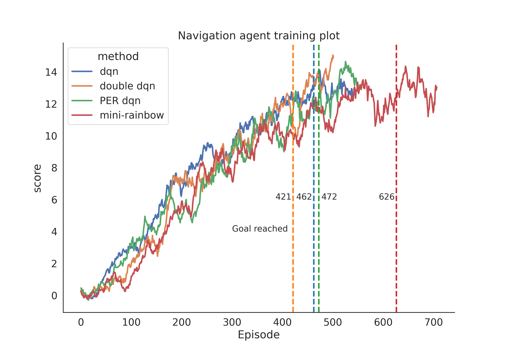

[//]: # (Image References)

[image1]: https://user-images.githubusercontent.com/10624937/42135619-d90f2f28-7d12-11e8-8823-82b970a54d7e.gif "Trained Agent"

# RL Navigation

### Introduction

This project utilizes deep reinforcement learning to train an agent to navigate in a large, square world and collect 
yellow bananas while avoiding blue bananas.

![Trained Agent][image1]

A reward of +1 is provided for collecting a yellow banana, and a reward of -1 is provided for collecting a blue banana.  Thus, the goal of your agent is to collect as many yellow bananas as possible while avoiding blue bananas.  

The state space has 37 dimensions and contains the agent's velocity, along with ray-based perception of objects around agent's forward direction.  Given this information, the agent has to learn how to best select actions.  Four discrete actions are available, corresponding to:
- **`0`** - move forward.
- **`1`** - move backward.
- **`2`** - turn left.
- **`3`** - turn right.

The task is episodic, and in order to solve the environment, your agent must get an average score of +13 over 100 consecutive episodes.

### Getting Started

1. Download the environment from one of the links below.  You need only select the environment that matches your operating system:
    - Linux: [click here](https://s3-us-west-1.amazonaws.com/udacity-drlnd/P1/Banana/Banana_Linux.zip)
    - Mac OSX: [click here](https://s3-us-west-1.amazonaws.com/udacity-drlnd/P1/Banana/Banana.app.zip)
    - Windows (32-bit): [click here](https://s3-us-west-1.amazonaws.com/udacity-drlnd/P1/Banana/Banana_Windows_x86.zip)
    - Windows (64-bit): [click here](https://s3-us-west-1.amazonaws.com/udacity-drlnd/P1/Banana/Banana_Windows_x86_64.zip)
    
    (_For Windows users_) Check out [this link](https://support.microsoft.com/en-us/help/827218/how-to-determine-whether-a-computer-is-running-a-32-bit-version-or-64) if you need help with determining if your computer is running a 32-bit version or 64-bit version of the Windows operating system.

    (_For AWS_) If you'd like to train the agent on AWS (and have not [enabled a virtual screen](https://github.com/Unity-Technologies/ml-agents/blob/master/docs/Training-on-Amazon-Web-Service.md)), then please use [this link](https://s3-us-west-1.amazonaws.com/udacity-drlnd/P1/Banana/Banana_Linux_NoVis.zip) to obtain the environment.

2. Place the file in the DRLND GitHub repository, in the 'navigation folder', and unzip (or decompress) the file. 

To correctly install all the dependencies that is needed please follow the udacity guide [here](https://github.com/udacity/deep-reinforcement-learning#dependencies).

If you have problems to get things to work there is a python folder included here that contain everything that is needed
in regards to get unity agent and such requirements as torch=0.4.0 to work. One than have the option to install it via
```
pip -q install ../python
```

To further install specific packages used for visualization and such install the packages in the requirements.txt file.
```
pip install -r requirements.txt
```

### Project

The different agents are trained notebooks.

* `navigation_dqn.ipynb` - training of agent with the original DQN algorithm
* `navigation_double_dqn.ipynb` - training of agent with the double DQN algorithm
* `navigation_per_dqn.ipynb` - training of agent with the PER DQN algorithm
* `navigation_mini_rainbow_dqn.ipynb` - training of agent with the mini-rainbow DQN algorithm

information about the environment and algorithm details are documented in report.pdf

The `navigation_master_nootebook.ipynb` notebook calls the other notebooks as well as plot a comparison of the scores 
for the algorithms over the training episodes.

The resources folder contains plots, training checkpoints and raw metrics used to evaluate the trainings.
* `metrics` - folder contain raw numpy metrics for the training as well as the episode when the agent reached its goal
* `plots` - folder contains individual plots for each agent (both with and without smoothing) as well as a comparison.
* `weights` - contains the fully trained weights of the agents.

## Results
One flaw of the results is that they are based of individual runs without extensive hyperparameter search and not an 
aggregated measurement. For these experiments the double DQN performed the best and the only method that better than
the original DQN baseline. Combining double DQN with PER (mini-rainbow) achieved the worst score with a large margin and by the looks 
of it had a hard time converging at the end of training. There is a possibility that this is mainly due to not-optimal
 hyperparameters.



For more extensicve discussion of the results and future work, see the [report](report.pdf).